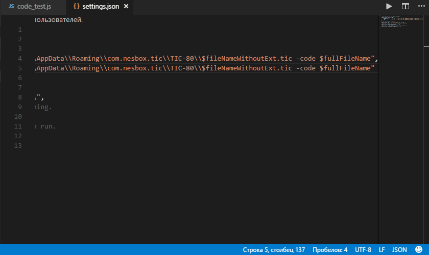
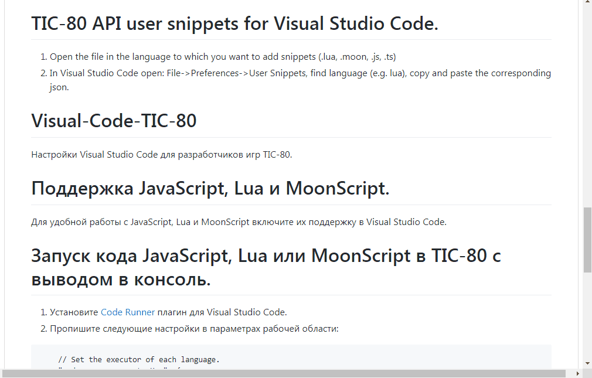
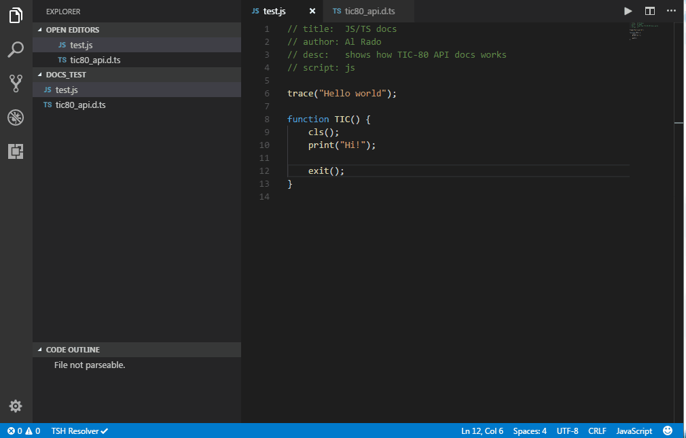

# Visual-Code-TIC-80
Visual Studio Code settings for TIC-80 game developers.



Support JavaScript, Lua and MoonScript.
=======================================  
For convenient work with JavaScript, Lua and MoonScript enable them in Visual Studio Code.

Run JavaScript, Lua or MoonScript code in TIC-80 with output to the console.
============================================================================ 
1. Install [Code Runner](https://marketplace.visualstudio.com/items?itemName=formulahendry.code-runner) plugin for Visual Studio Code.
2. Describe the following settings in the workspace settings:
```json
    // Set the executor of each language.
    "code-runner.executorMap": {
        "javascript":   "tic.exe C:\\Users\\alrad\\AppData\\Roaming\\com.nesbox.tic\\TIC-80\\$fileNameWithoutExt.tic -code-watch $fullFileName",
        "lua":          "tic.exe C:\\Users\\alrad\\AppData\\Roaming\\com.nesbox.tic\\TIC-80\\$fileNameWithoutExt.tic -code-watch $fullFileName",      
        "moonscript":   "tic.exe C:\\Users\\alrad\\AppData\\Roaming\\com.nesbox.tic\\TIC-80\\$fileNameWithoutExt.tic -code-watch $fullFileName"      
    },
    // Set the working directory.
    "code-runner.cwd": "C:\\Program Files\\TIC-80\\",
    // Whether to save the current file before running.
    "code-runner.saveFileBeforeRun": true,
    // Whether to clear previous output before each run.
    "code-runner.clearPreviousOutput": true
```
Where path `C:\\Users\\alrad\\AppData\\Roaming\\com.nesbox.tic\\TIC-80\\` - is the folder where your cards with *.tic are saved. **If you want find it, type `folder` in TIC-80 console.**  
If a cartridge with the same name as the code file name is not found, the default cartridge will start and your code will be loaded into it.  
`"code-runner.cwd": "C:\\Program Files\\TIC-80\\"` - path to your tic application.  

3. To start, click on the "Run Code" button or the `CTRL+ALT+N`

TIC-80 API user snippets for Visual Studio Code.
================================================
1. Open the file in the language to which you want to add snippets (.lua, .moon, .js, .ts)
2. In Visual Studio Code open: File->Preferences->User Snippets, find language (e.g. lua), copy and paste the corresponding json.


TIC-80 API declarative files (TypeScript) and documentation.
============================================================
1. In order for TypeScript not to cause errors related to the application of TIC-80 API functions, copy the file tic80_api.d.ts to your project.
In this file, all functions of the TIC-80 API are declared and documented.
2. To display a description of the functions of the TIC-80 API when working with JavaScript, simply open the tic-80_api.d.ts file in Visual Studio Code and leave it open. If necessary, restart the editor.



# Visual-Code-TIC-80
Настройки Visual Studio Code для разработчиков игр TIC-80.

Поддержка JavaScript, Lua и MoonScript.
=======================================  
Для удобной работы с JavaScript, Lua и MoonScript включите их поддержку в Visual Studio Code.

Запуск кода JavaScript, Lua или MoonScript в TIC-80 с выводом в консоль.
======================================================================== 
1. Установите [Code Runner](https://marketplace.visualstudio.com/items?itemName=formulahendry.code-runner) плагин для Visual Studio Code.
2. Пропишите следующие настройки в параметрах рабочей области:
```json
    // Set the executor of each language.
    "code-runner.executorMap": {
        "javascript":   "tic.exe C:\\Users\\alrad\\AppData\\Roaming\\com.nesbox.tic\\TIC-80\\$fileNameWithoutExt.tic -code-watch $fullFileName",
        "lua":          "tic.exe C:\\Users\\alrad\\AppData\\Roaming\\com.nesbox.tic\\TIC-80\\$fileNameWithoutExt.tic -code-watch $fullFileName",      
        "moonscript":   "tic.exe C:\\Users\\alrad\\AppData\\Roaming\\com.nesbox.tic\\TIC-80\\$fileNameWithoutExt.tic -code-watch $fullFileName"     
    },
    // Set the working directory.
    "code-runner.cwd": "C:\\Program Files\\TIC-80\\",
    // Whether to save the current file before running.
    "code-runner.saveFileBeforeRun": true,
    // Whether to clear previous output before each run.
    "code-runner.clearPreviousOutput": true
```
Где путь `C:\\Users\\alrad\\AppData\\Roaming\\com.nesbox.tic\\TIC-80\\` - это путь к папке, где сохранены Ваши файлы с расширением *.tic. **Если Вам нужно найти её, наберите команду `folder` в консоли TIC-80.**  
Если картридж с таким же именем как и имя файла кода не найден, запустится дефолтный картридж и в него загрузится Ваш код.  
`"code-runner.cwd": "C:\\Program Files\\TIC-80\\"` - путь к исполняемому файлу tic.  

3. Для запуска нажмите на кнопку "Run Code" или клавиши `CTRL+ALT+N`

TIC-80 API пользовательские сниппеты для Visual Studio Code.
============================================================
1. Откройте файл на том языке, к которому Вы хотите добавить сниппеты (.lua, .moon, .js, .ts)
2. В Visual Studio Code откройте: File->Preferences->User Snippets, найдите язык (например lua), скопируйте и вставьте соответствующий json.

TIC-80 API декларирующие файлы(TypeScript) и документация.
==========================================================
1. Для того чтобы TypeScript не вызывал ошибки связанные с применением функций TIC-80 API, скопируйте в свой проект файл tic80_api.d.ts 
В этом файле задекларированы и задокументированы все функции TIC-80 API.
2. Для отображения описания функций TIC-80 API при работе с JavaScript просто откройте файл tic-80_api.d.ts в Visual Studio Code и оставьте открытым. При необходимости перезапустите редактор.